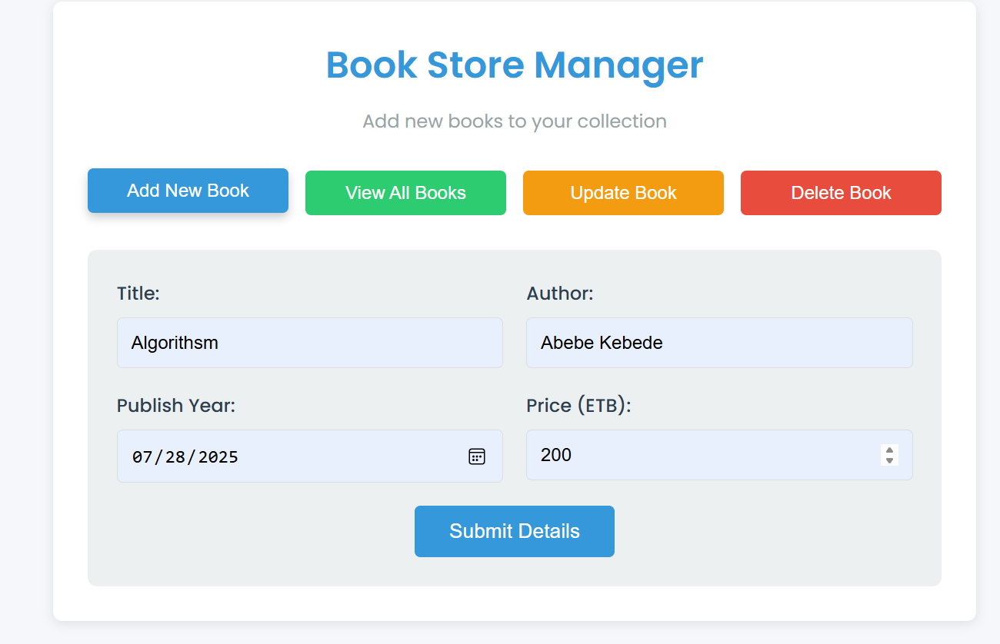
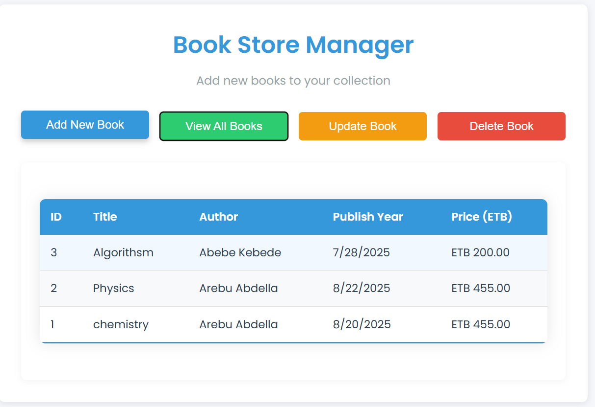

## 🖼️ Demo Screenshots

### ➕ Add a New Book
This screenshot shows the form for adding a new book, which sends a `POST` request to the server.

---

### 📖 View All Books
This shows the list of all added books fetched from the backend using a `GET` request.

---

# fullstack-CRUD-oprations
fullstack(MYSQL, express , JS, CSS ,HTML) oprations which includes all basic commen express methodes (get, put, post and delete).
🛠️ Core Express Methods Explained
1. GET - Retrieve Books
javascript
// Backend (Express Route)
app.get('/books', async (req, res) => {
  const books = await Book.findAll(); 
  res.json(books);
});

// Frontend Usage
fetch('/books')
  .then(res => res.json())
  .then(books => renderBookList(books));

  2. POST - Add New Book
     // Backend
app.post('/books', async (req, res) => {
  const newBook = await Book.create(req.body);
  res.status(201).json(newBook);
});

// Frontend
fetch('/books', {
  method: 'POST',
  headers: { 'Content-Type': 'application/json' },
  body: JSON.stringify({
    title: "The Pragmatic Programmer",
    author: "Andrew Hunt"
  })
});
3. PUT - Update Book Details
// Backend
app.put('/books/:id', async (req, res) => {
  const updated = await Book.update(req.body, {
    where: { id: req.params.id }
  });
  res.json(updated);
});

4. DELETE - Remove Book
   app.delete('/books/:id', (req, res) => {
  const id = req.params.id;
  pool.query('DELETE FROM books WHERE id = ?', id, (error) => {
    if (error) throw error;
    res.status(204).send();
  });
});
